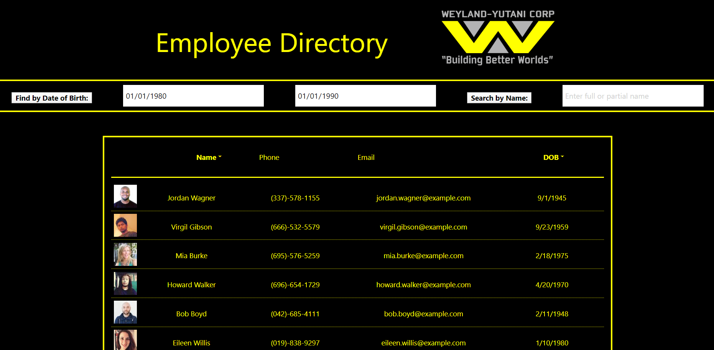

# Employee Directory

This is an app witten with React that enables a manager to quickly see and organize a list of employees by birthday, or search for a specific employee by name.

Check out the repo [here](https://github.com/agtravis/employee-directory), and see the app in operation [here](https://agtravis.github.io/employee-directory/).

This app runs in the browser - see [Setup](#setup) below for instructions on how to use.

## Table of contents

- [Screenshots](#screenshots)
- [Technologies](#technologies)
- [Code Examples](#code-examples)
- [Setup](#setup)
- [Features](#features)
- [Status](#status)
- [Contact](#contact)

## Screenshots



There is only one page to this app, and the results only re-organize or reduce.

## Technologies

This app was written in `JavaScript` running in `Node.JS`, and is written using the `React` library. It uses `axios` to populate the 'database' with a mock team of employees, via `randomuser.me`. On the front end it uses `Materialize` for some responsive elements and fonts among other natural imports, however it is NOT mobile-first.

## Code Examples

I initially wrote this app

## Setup

To set up this app as a user, you simply go to the website [here](https://rinqydinky.herokuapp.com/) and sign up for an account. All it requires is a username and password. From that point you are automatically logged in and ready to go, or on following visits you would login with those credentials. All your scores are stored in your own personal history, and users can delete any scores of their own with which they are unhappy. Users can also change their password from inside their profile.

### Gameplay

The rules of the space shooter game itself are very simple. You start with 3 lives, and if an enemy ship touches you, you lose a life. If you destroy an enemy, you score points, but if an enemy makes it to the bottom of the screen, you lose points (negative scores are totally possible). Different ships have different speeds, and will take varying amounts of points off your score. You will not be able to get every ship, so this game is about making decisions on the fly about which objectives are more important. Every 30 seconds when the game levels up, power-ups will appear containing extra lives, but don't shoot them! As the levels go up, the speed intensifies and the scores and penalties increase!

Use the cursor keys to move around, and spacebar to shoot.

## Features

This app has a cool chat feature that enables users to talk to each other while playing. The fact that you have to sign up for an account makes it more competitive and helps identify individuals in the chat.

## Status & Future Developement

This app already achieves more than we set out to achieve. Our MVP was simply to provide a fun, basic game platform, using JavaScript, and running it in the browser. Adding the sign in and chat features brings us to MVP+. To take it to MVP++, we would like to have multiple games, all with their own accompanying high scores. The logical next step for MVP+++ would be to enable users to submit their own games to add to the arcade, and ultimately we could provide tools (spritesheets, tilemaps, code examples & tutorials) for users to do this.

Multiplayer.....................................

## Contact

Created by [@agtravis](https://agtravis.github.io/) | [@agtravis](https://agtravis.github.io/) | [@ddhoang21](https://ddhoang21.github.io/My-Portfolio/)

https://agtravis.github.io/employee-directory/

_There is a deliberate "error" in the UI, please read the further development section for an explanation!_

## Further Development

As I mentioned at the start, and as you may have noticed if you already tested out the site, there is a pretty obvious "error" in the UI. I use the quotations because it is not really an error, it is by design. I'll explain....

I wanted to implement React's `useContext` feature in my project. Upon completion to the brief, I was looking for ways to further enhance my project. I realized halfway through doing this that I was about to break a lot of my code, in as much as this kind of `hook` cannot be implemented _as is_ into a class component, only a function component. In order to avoid rewriting the whole class and all accompanying methods, and restructuring all the state elements involved, I decided to simply implement ONE case of my custom `useContext` hook in operation.

As a result, you, the user, will always see the same one "fake" (all the employees are faked, but this one is double faked) employee at the top of the list, regardless of which search or organize functions are called. In fact, even when the search results should yield nothing (a name search for "kfjagkdgfa" should not return any results), this employee remains. Here is why:

```js
    function List(props) {
        const [employees, setEmployees] = useContext(EmployeeContext);
        const propsEmployees = [...props.employees];
        propsEmployees.unshift(...employees);
        return (
            <ul className="list-group">
            {propsEmployees.map((employee) =>
```

First I am importing an array `employees` from `EmployeeContext`. This is actually just an array of this one employee, with the JSON matching the format of the actual API response. A new array is created as a copy (since props are immutable) of the array containing all the API employees, and then the fake is added (using `unshift` so the fake is always first and appears at the top) to the array. Then the `.map` function which is responsible for generating what appears on the screen runs on this ammended array. So even when a search is run on the array, this fake is always added AFTER the search is performed.

As I said, the only reason I am doing this is to demonstrate the technique of using `useContext`.

If I was to switch the class component in App over to a function, in order to continue to use the dynamic data, here is how I would do it:

From inside the `EmployeeContext` file, I am already exporting `setEmployees` as a function. Within the hypothetical App function component, I would include the following line:

```js
const [employees, setEmployees] = useContext(EmployeeContext);
```

and of course I would be sure to input all the relevant components for this to work (all `no-unused-vars` linting errors are related to this implementation). Instead of using `componentDidMount` for the API request I would be using `useEffect`, and now instead of calling `this.setState`, I would simply call `setEmployees`.
