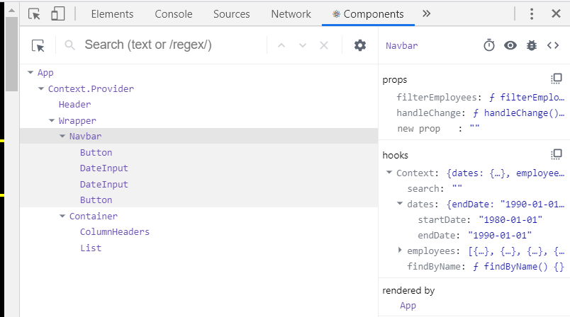

# Employee Directory

This is an app witten with React that enables a manager to quickly see and organize a list of employees by birthday, or search for a specific employee by name.

Check out the repo [here](https://github.com/agtravis/employee-directory), and see the app in operation [here](https://agtravis.github.io/employee-directory/).

This app runs in the browser - see [Setup](#setup) below for instructions on how to use.

## Table of contents

- [Screenshots](#screenshots)
- [Technologies](#technologies)
- [Code Examples](#code-examples)
- [Setup](#setup)
- [Status](#status)
- [Contact](#contact)

## Screenshots


There is only one page to this app, and the results only re-organize or reduce.

## Technologies

This app was written in `JavaScript` running in `Node.JS`, and is written using the `React` library. It uses `axios` to populate the 'database' with a mock team of employees, via `randomuser.me`. On the front end it uses `Materialize` for some responsive elements and fonts among other natural imports, however it is NOT mobile-first.

## Code Examples

I initially wrote this app based around class components and using `this.state` in the constructor and `componentDidMount` method to perform the API request (see an early commit of my `app.js` file [here](https://github.com/agtravis/employee-directory/blob/306eb5b9e89f6b110e1a0437c59e9bdfec206a14/src/App.js)), but after learning about `useContext`, I switched those classes to functions and switched over (this took a while, but was worth it upon completion!). I still am utilizing some `prop drilling` in situations where the data is smaller, so it can still be accessed via `props`.

For an example of how the app code is traversed by a user, let's look at when a user sets the dates to narrow down the field of employees by birth date. In the UI, all the user does is select a start date and an end date, then click the button, and the results adapt (for convenient, `defaultValue`s have been set):

```js
const [dates, setDates] = useState({
  startDate: `1980-01-01`,
  endDate: `1990-01-01`,
});
```

First, in `app.js`, `useState` is called and creates an object with two properties, a start date and an end date (here is where they are set by default). Two variables are deconstructed out of this, the conentional two, the first representing the state (in this case an object), and the second representing the function that will update the state when called.

Also in `app.js` there is a function that will perform the filter:

```js
function filterEmployees(startDate, endDate) {
  let start = new Date(startDate);
  let end = new Date(endDate);
  const filteredEmployees = [...employees].filter((employee) => {
    let date = new Date(employee.dob.date);
    return date >= start && date <= end;
  });
  setEmployees(filteredEmployees);
}
```

This takes two parameters that will be passed in from the function call - the start date and end date that the user has selected. Since they are passed in as strings, they need to be formatted so they can be compared in the correct way by making them `Date` objects. Once this has been done, they can be use in the `filter` method to be compared to a Date object created on the employee's own date of birth. After this is done, the `setEmployees` method is called, and this sets the state of the employees to be the reduced array of employees just created. This `setState` (going on behind the scenes) causes the browser to re-render any component that uses this information.

`filterEmployees` is passed down using `props`, and the dates themselves are passed to the `Context` file:

```js
return (
  <div>
    <EmployeeContext.Provider value={{ search, dates, employees, findByName }}>
      <Header />
      <Wrapper>
        <Navbar filterEmployees={filterEmployees} handleChange={handleChange} />
        <Container>
          <ColumnHeaders sortEmployees={sortEmployees} />
          <List />
        </Container>
      </Wrapper>
    </EmployeeContext.Provider>
  </div>
);
```

`<EmployeeContext.Provider>` is essentially a wrapping `<div>` that allows anything inside it to have access to its contents. Following on with my example, specifically part of the value is set as `dates`. This sets up the context to store the dates properties. This can be seen in the Dev Tools for React specifically (under `hooks`):



I am passing one method in here, `findByName`, however I am passing the `filterEmployees` method through `props` directly in the `<Navbar>` component, seen in the above screen shot under `props`.

Next, in the NavBar component, the following line:

```js
const { search, dates, findByName } = useContext(EmployeeContext);
```

gives this component access to the deconstructed properties of this context. At this point in my code, I am mixing the two methods of passing data. I could actually import the properties into the `<DateInput>` component, however, partly due to the legacy of how I initially wrote my code, and mainly due to demonstrative purposes, I have left it so that these properties imported from Context are then passed down to nested components using props - I understand this is redundant and would not do this in a professional project. Within the `<DateInput>` component, the `onChange` event listener handles what happens when the user change dates. I won't go into details, but the method is written so as it can be applied to multiple instances of use back in `app.js`. The function that runs the `filterEmployees` method is called `onClick` of the appropriate button:

```js
onClick={() => props.whenClicked(...props.args)}
```

`props.args` is spread because it is being passed an array of the values stored in context representing the start and end dates. And thus, the method is called and passed the information it needs to filter the employees and re-render.

## Setup

There is no setup, just access the website.

## Status & Future Developement

Since this app mocks the database, each time it is refreshed a new set of employees is rendered. When filters are applied to the results array, those employees filtered out are lost for good as a result. If this was a real life application, the employees would be drawn from a database, and therefore a reset button could be implemented to remove filters, however in order to make this work I would need to establish a way of keeping the state of the database. There are various ways I could do this, I could copy the original response and draw from that, or I could mock a database with a JSON file, or I could create an actual database.

The app also has had minimum styling applied to it, and is not mobile first.

## Contact

Created by [@agtravis](https://agtravis.github.io/)
